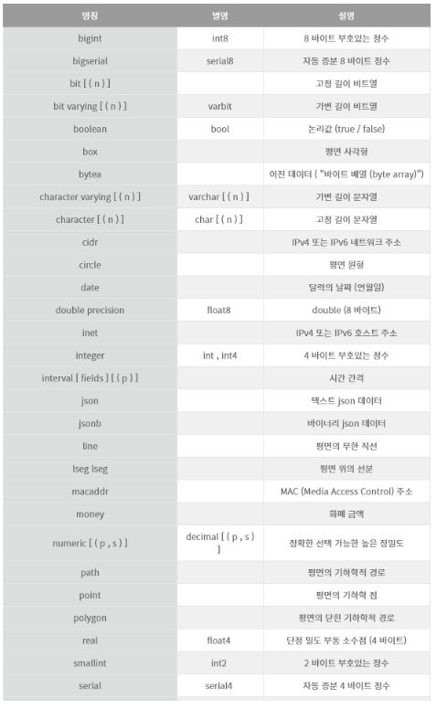
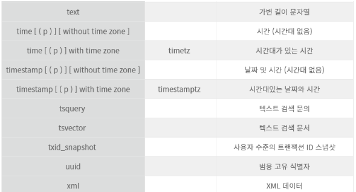

# 공부자료

## 출저 
https://www.devkuma.com/docs/postgresql/

## Dbevaer 

* sql developer 같은 툴 > postgre 사용시 쓸건데 > 다양한 데이터베이스도 연결이 가능함. 
* sql script를 새로 열어서 만듬 
* 저장은 C:\Users\사용자명\AppData\Roaming\DBeaverData\workspace6\General\Scripts 여기다 되는 듯? 
* SQL 편집기 > SQL 스크립트 불러오기, 저장 등으로 가져올 수 있음.

## Postgre

* 14,13,12,11 등 다양한 버전이 있음
* psql : postgre 사용을 위한 sql > 이걸로 스크립트문을 실행가능하다. 
  * 환경변수 설정을 해야 사용가능 
  * C:\Program Files\PostgreSQL\11\bin 이렇게 Path에 넣으면 됨(명령어가 프로그램 형태로 있음)

## Windows에서 서비스 시작 및 중지
* 컴퓨터 관리 탭 > 서비스 > postgresql-x64-12 > 중지, 시작 


## PostgreSQL 연결
* psql -h {호스트명} -p {포트 번호} -U {사용자명} -d {데이터베이스명}
* 기본 보트가 5432라 생각가능, localhost라면 호스트명도 생략가능
* -U는 사용자인데 처음에 postgres라고 자동생성된다. (로그인 용도)
* -d는 데이터베이스명인데 postgres 이걸로 큰 틀로 스키마들을 구분한다. 
  * psql -U postgres -d ctl_db -a -f 스크립트파일이름
  * psql -U postgres -f file.sql 이런식 
  * 요런식으로 스크립트 실행함
  * psql 입력하면 비밀번호 입력하라고 나옴 > 이것도 shell script로 입력되게 하면 좋은데. 
* psql -U postgres 입력하면 
* 스크립트 단으로 빠짐 postgres=# 뜬다.  \q 입력하면 연결 종료
* psql -V 입력하면 버전 나온다. psql -? 도움말 
* postgre=# 단으로 진입하면 ; 만날 때까지 계속입력이다. 
* postgres=# create database sample; 이렇게 입력하면 데이터베이스 생성 

```
C:\Users\ngoti>psql -U postgres
psql (11.21)
도움말을 보려면 "help"를 입력하십시오.

postgres=# create database sample
postgres-# ;
CREATE DATABASE
postgres=#
-- 세미클론 만날때까지 계속 입력받음
```

* \l 이렇게 입력하면 데이터베이스가 조회된다.  > 리스트를 조회하는 것임

```
postgres=# \l
                                      데이터베이스 목록
   이름    |  소유주  | 인코딩 |     Collate      |      Ctype       |      액세스 권한
-----------+----------+--------+------------------+------------------+-----------------------
 hr        | postgres | UTF8   | Korean_Korea.949 | Korean_Korea.949 |
 postgres  | postgres | UTF8   | Korean_Korea.949 | Korean_Korea.949 |
 sample    | postgres | UTF8   | Korean_Korea.949 | Korean_Korea.949 |
 template0 | postgres | UTF8   | Korean_Korea.949 | Korean_Korea.949 | =c/postgres          +
           |          |        |                  |                  | postgres=CTc/postgres
 template1 | postgres | UTF8   | Korean_Korea.949 | Korean_Korea.949 | =c/postgres          +
           |          |        |                  |                  | postgres=CTc/postgres
```


```

* 위에서 생성된 DB로 dbeaver로 접속이 된다. 
* postgresql.conf 파일 
* pg_hba.conf 파일이 있는데 가끔씩 mybatis로 psql 접속이 안되거나 암호를 입력해도 접속이 안되는 경우가 있는데 이경우에는 접근 권한이 없다는 것 > 그래서 METHOD 부분에 trust를 입력해야 한다. 


### PostgreSQL 기본 구성
* 문자열은 ''로 감싸서 작은 따옴표 넣으려면 '' 두번으로 연속 
```


* 문자열
```
select 'Hello world'; 이렇게 입력하면 Hello world라고 테이블로 한개 값나온다. 

e를 붙이면 이스케이프 문자열을 사용할 수 있다. \t를 문자열 안에 넣고 출력 가능하다.
postgres=# select e'문자\t열';
  ?column?
------------
 문자    열
(1개 행)
```


create table "select"(id integer);

* select * from "select"; 이렇게 " "감싸서 쿼리 날려야함 

* 처음 접속하면 postgres라는 DB로 접속한다. 
* 아래처럼 입력하면 내가 날린 쿼리 확인할 수 있다. pid 를 여기서 기억하고 pg_cancel_backend에 pid를 넣으면 쿼리를 취소시킬 수 있다. 
* postgres=# SELECT * FROM pg_stat_activity WHERE datname = 'postgres';
* SELECT pg_cancel_backend(pid int); 


* 테이블 목록 조회는
  * SQL에서는 SELECT * FROM pg_tables; 이런 쿼리를 날린다. 
  * 콘솔에서는 \dt 이렇게 입력하면 된다. 

* 위에 생성한 테이블 지울건데 테이블 삭제는 drop table "select"; 으로 동일하다. 


* 키워드(조심하기 아래꺼 안쓰도록 이건 DB마다 비슷)
```
ALL
ANALYSE
ANALYZE
AND
ANY
ARRAY
AS
ASC
ASYMMETRIC
AUTHORIZATION (함수 또는 형식으로 사용 가능)
BINARY (함수 또는 형식으로 사용 가능)
BOTH
CASE
CAST
CHECK
COLLATE
COLLATION (함수 또는 형식으로 사용 가능)
COLUMN
CONCURRENTLY (함수 또는 형식으로 사용 가능)
CONSTRAINT
CREATE
CROSS (함수 또는 형식으로 사용 가능)
CURRENT_CATALOG
CURRENT_DATE
CURRENT_ROLE
CURRENT_SCHEMA (함수 또는 형식으로 사용 가능)
CURRENT_TIME
CURRENT_TIMESTAMP
CURRENT_USER
DEFAULT
DEFERRABLE
DESC
DISTINCT
DO
ELSE
END
EXCEPT
FALSE
FETCH
FOR
FOREIGN
FREEZE (함수 또는 형식으로 사용 가능)
FROM
FULL (함수 또는 형식으로 사용 가능)
GLOBAL
GRANT
GROUP
HAVING
ILIKE (함수 또는 형식으로 사용 가능)
IN
INLINE
INNER (함수 또는 형식으로 사용 가능)
INTERSECT
INTO
IS (함수 또는 형식으로 사용 가능)
ISNULL (함수 또는 형식으로 사용 가능)
LATERAL
LEFT (함수 또는 형식으로 사용 가능)
LIKE (함수 또는 형식으로 사용 가능)
LIMIT
LOCALTIME
LOCALTIMESTAMP
NATURAL (함수 또는 형식으로 사용 가능)
NOT
NOTNULL (함수 또는 형식으로 사용 가능)
NULL
OFFSET
ON
ONLY
OR
ORDER
OUTER (함수 또는 형식으로 사용 가능)
OVERLAPS (함수 또는 형식으로 사용 가능)
PLACING
PRIMARY
REFERENCES
RETURNING
RIGHT (함수 또는 형식으로 사용 가능)
SELECT
SESSION_USER
SIMILAR (함수 또는 형식으로 사용 가능)
SOME
SYMMETRIC
TABLE
TABLESAMPLE (함수 또는 형식으로 사용 가능)
THEN
TO
TRAILING
TRUE
UNION
UNIQUE
USER
USING
VARIADIC
VERBOSE (함수 또는 형식으로 사용 가능)
WHEN
WHERE
WINDOW
WITH
```

* 주석은 --이 한줄, /*   */은 여러줄 주석

## 연습용 Sample DB 설치
https://www.postgresqltutorial.com/postgresql-getting-started/postgresql-sample-database/

설치하면 파일 format이 tar파일인데 Database 만들고 그 안에다가 넣어보자 

* dbeaver에서 database 우클릭해서 복원으로 tar를 넣으려고 했으나 오류뜸. tar는 정상적으로 지원하는 포맷이 아닌가봄
* pgAdmin으로 들어가서 생성한 hr 우클릭해서 
* dvdrental.tar를 restore해서 불러오기
* Schemas > public > Tables 밑에 테이블 생긴 것을 확인한다.
* public이라는 것을 확인할 수 있는데 이것은 기본 스키마이다. create table 명령으로 테이블을 만들 경우에 테이블 이름에 스키마를 <b>생략하면</b> public 스키마에 테이블이 만들어진다. 
> 정리하면 user로 접속하여 database에 여러 스키마들을 보관하고 하나의 스키마에 여러 테이블을 가지고 있을 수 있는 구조다. 

```
-- 이렇게 만들면 test 스키마에 sample_table이 만들어지고 
create table test.sample_table(id integer);

-- 이건 public 스키마에 sample_table이 만들어진다. 
create table sample_table(id integer);
```
* 식별자와 키워드는 대소문자를 구별하지 않는다. 
```
아래 두 줄은 동일
SELECT * FROM MYTBL;
select * from mytbl;
```

### Simple 사용법+자료형 정리 > ex01.sql
* 자료형



### 데이터베이스, 스키마 생성 등 > ex02.sql


### Postgre는 dual이 없다. sysdate도 없다. now()쓴다. 
* 테이블 부분 안쓰면 알아서 듀얼처리 된다. 
* select 'test입니다.' as TEST from dual; -- oracle
* select 'test입니다.' as TEST; -- postgre

* select to_char(now(), 'yyyy-mm-dd'); 이런것도 된다. 오라클과 비슷 

### CREATE TABLE
```
CREATE TABLE 테이블명(
  칼럼이름 자료형 키속성(primary key)
  칼럼이름 자료형 NULL인지 NOT NULL인지 DEFAULT 값
  FK 같은 제한조건
);
```

### CONSTRAINT > PK, FK, CHECK
* 오라클과 거의 동일한데.. 
* 예제 몇개만 설정하기 
```
```


## CRUD는 거의 비슷하다. 딱히 공부할 게 없는 듯?
### INSERT 

### SELECT

### UPDATE

### DELETE


