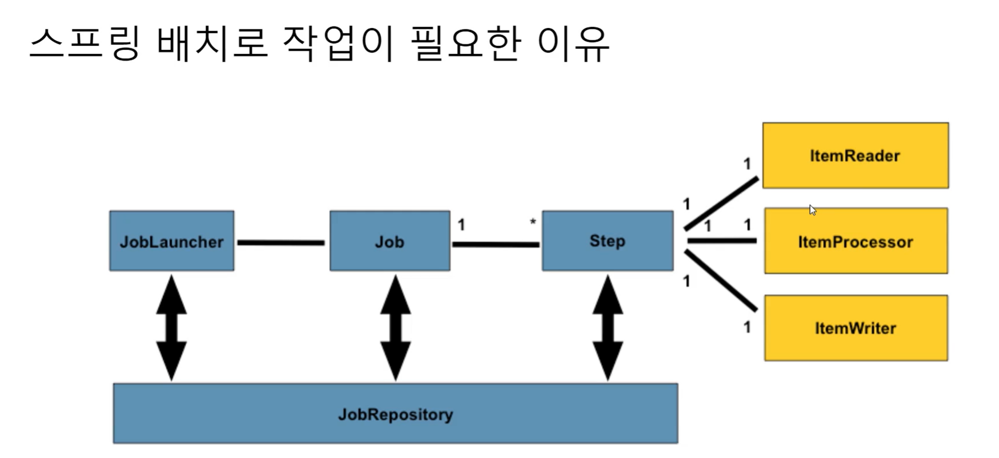
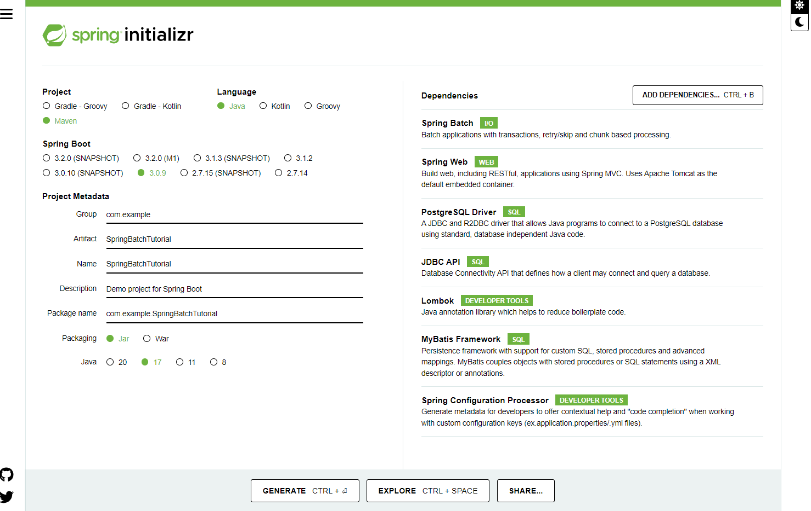
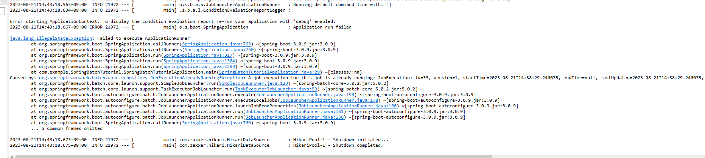
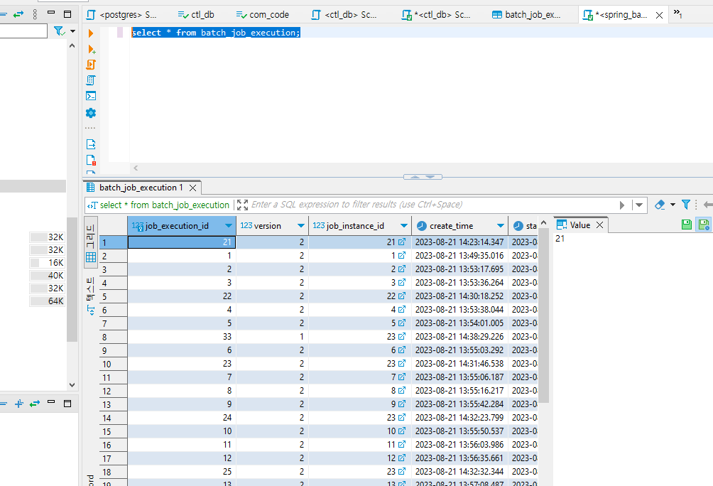

### 스프링 배치 

#### 스프링 배치 작업이 필요한 이유

* 일반작업 > 실시간 작업
  * 고객 > 주문 > 응답 
* 배치작업 
  * 특정 기간을 두고 모아서 처리(주기마다)
  * 바로바로 처리하기에 부담스럽다. 
  * 배송실시, 은행/가맹점 정산 등의 업무 등을 모아서 처리 
  * 예시) 이메일 쿠폰 발송, 가맹점 정산, 거래 명세서 생성 등 

* JobRepository가 각종 메타데이터, 배치수행된련 데이터를 저장 
* Job주 작업 영역 
* Job은 하나의 배치작업 
* 세부적인 내용은 Step에서 처리한다. 




* 프로젝트 생성 
  * 추후에 devtools 설치 

  



* Spring Batch 5.0부터 코드 방식이 바뀜
* 아래와 같은 방식을 안씀
```
//	@Autowired
//	private JobBuilderFactory jobBuilderFactory;
//	@Autowired
//	private StepBuilderFactory stepBuilderFactory;
```
* 다음과 같은 방법을 쓴다. > new로 JobBuilder, StepBuilder 만들어서 사용한다. 
* @EnableBatchProcessing 이걸 쓰지 않는다 쓰면 동작이 안됨
```
@Bean
	public Job helloWorldJob(JobRepository j
  obRepository, PlatformTransactionManager transactionManager) { //Job실행시 ID 부여, 시퀀스를 순차적으로 부여할 수 있도록 이렇게 한다.
		return new JobBuilder("helloWorldJob", jobRepository)   
				.start(helloWorldStep1(jobRepository, transactionManager)) // Job안에는 step이 존재한다. 
				.next(helloWorldStep2(jobRepository, transactionManager))
				.build();
	}
```


```
public Step helloWorldStep2(JobRepository jobRepository , PlatformTransactionManager transactionManager) {
        return new StepBuilder("step2", jobRepository)
                .tasklet((contribution, chunkContext) -> {
                    log.info("hello world step2!");
                    return RepeatStatus.FINISHED;
                }, transactionManager).build();
    }
```
* Step에서 return RepeatStatus.CONTINUABLE; 이거 썼다가 에러남 
* 이럴 때 다시 실행시키면 동일 명령어 사용시 에러나는건데 version=2라는 인자만 그냥 붙이면 해결

* SpringBatch를 위한 테이블이 자동으로 생기게 설정 
  * initialize-schema: always
* 배치기록이 테이블에 담긴다.




### 리스너
* 잡이 실행되기 전과 후에 등록할 수 있다. 
* 예를 들어서 로그를 쌓아줄 수 있다. 


* https://khj93.tistory.com/entry/Spring-Batch%EB%9E%80-%EC%9D%B4%ED%95%B4%ED%95%98%EA%B3%A0-%EC%82%AC%EC%9A%A9%ED%95%98%EA%B8%B0


* https://github.com/Doohwancho/spring/blob/131118badbe2e4ddcef253efcd50fcb0bb93f2a7/spring-batch/simple-batch/modules/src/main/java/com/example/step5Chunk/step02Mybatis/ExampleJobConfig.java#L77

* 이것도 참고할 것 
* https://mybatis.org/spring/ko/batch.html


* https://github.com/codej99/SpringBatch/blob/master/src/main/java/org/codelab/batch/mapper/PersonMapper.java